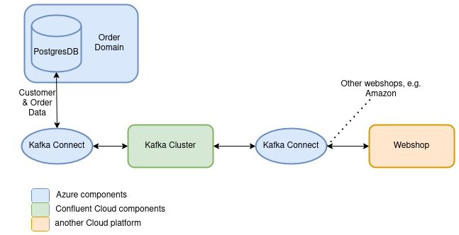

= Using a Secret Provider with Kafka Connect
== Teaser

Kafka Connect, coming along with many pre-build Connectors, can be a useful addition to your Kafka cluster. The setup can be done within minutes - until you come to the point where you start thinking about security. What is the best way to handle my secrets in Connector configurations when I - of course- do not want to expose them in plaintext? In this blog article, we step through an example scenario where it will be shown why and when to use Kafka Connect and how to inject credentials into Connector configurations. We will see that there are some pitfalls to be aware of if the Connect setup should not take much more time than estimated.

== Why and when should you use Kafka Connect?

For better understanding, let's have a look at an example scenario: We assume that there is an existing system where one component is processing data that is needed by another component. This could be, for example, a domain that processes customer data and product information and writes it into a database. A webshop was later on added to our architecture and now needs the customer and product data. Of course, we could modify our order domain to pass the data directly to the webshop service. But first of all, in most cases, it will not be possible to modify existing systems. Second, we assume that there are plans to add additional web shop services, e.g., like Amazon or eBay, later on, that also need the same kind of data. To solve this, Kafka can serve as a central component from where all webshops will get their data from. Additionally, Kafka Connect makes it possible to get the customer and product data from the database into Kafka. Depending on the API of the webshop service, Kafka Connect can also be used to transfer data from Kafka into the webshop. +
To complete the scenario, we could also think of the webshop service writing order details into Kafka, which then forwards this information to the order domain.

As shown in the below figure, the order domain, the database and Kafka Connect are running in Azure while the remaining part of the Kafka cluster is running in Confluent Cloud. Therefore, Kafka Connect needs to authenticate against the database and the Confluent Cloud cluster. The scenario was implemented as part of a showcase investigating how to use a Secret Provider for Kafka Connect. Feel free to have a look at the https://github.com/NovatecConsulting/technologyconsulting-showcase-integrationdomain[repository] and test the code by yourself!

== Kafka Connect and Confluent Cloud Authentication
Authentication of Connect against Confluent Cloud is the "easy" part of this scenario: The https://docs.confluent.io/cloud/current/cp-component/connect-cloud-config.html#standalone-cluster[documentation] describes how to edit the worker properties file to enable a connection. Note the properties consumer.sasl.jaas.config, producer.sasl.jaas.config and sasl.jaas.config where the values contain your Confluent Cloud API-key and API-secret. Those values need to be injected externally, while the best approach to do this depends on your setup and deployment process. Within the https://github.com/NovatecConsulting/technologyconsulting-showcase-integrationdomain[showcase repository], this was done using a Github Actions pipeline. The pipeline pulls those secrets from the Azure key vault and overrides them at the helm values.yaml file. This approach is also shortly discussed at the end of this article.

== Connector Configuration and Secret Management

https://docs.confluent.io/platform/current/connect/index.html[Kafka Connect] is a framework that is using pre-build Connectors that enable to transfer data between sources and sinks and Kafka. For example, there are Connectors available at the websites of https://www.confluent.io/hub/[Confluent] and https://camel.apache.org/camel-kafka-connector/latest/reference/index.html[Camel] that can be used to access databases, key-value stores and file systems. A Kafka Connect Cluster consists of one or more connector instances of which the configurations are deployed via Kafka Connect's REST API. The classes that are used by these connector instances are defined in connector plugins. Therefore, to deploy a connector configuration, the connector plugin needs to be installed beforehand.

The Connector configuration will usually contain the credentials of the system you want to access, e.g., your database username and password:

[source, json]
----
{
    "name": "postgres_sink",
    "config": {
        "connector.class": "io.confluent.connect.jdbc.JdbcSinkConnector",
        "tasks.max": 1,
        "topics": "example_topic",
        "connection.url": "jdbc:postgresql://example.postgres.database.azure.com:5432/db",
        "connection.user": "myDatabaseUser",
        "connection.password": "myDatabasePassword",
        "auto.create": "true",
        "table.name.format": "example_table",
        "dialect.name": "PostgreSqlDatabaseDialect",
        "db.timezone": "Europe/Berlin",
        "pk.mode": "record_key",
        "insert.mode": "upsert"
    }
}
----

When researching online and reading tutorials, you will notice that most examples will look similar to this. Confluent's documentation also provides https://docs.confluent.io/kafka-connect-jdbc/current/source-connector/index.html#load-the-jdbc-source-connector[example configurations], but most of them without using any credentials or using them in plaintext. Clearly, for examples and learning, this is sufficient but not when running in production. First, the Connectors configuration can be accessed and read using a simple curl-command - making it readable for everybody who has access to the REST API. Second, usernames and passwords are objects to change from time to time - and you do not want to edit your code and redeploy it whenever making changes. Additionally, credentials usually differ between stages, and therefore, need to be configurable per stage/deployment. And last and most obviously: The configuration should be accessible for users, but without exposing the credentials at the same time.
 +
To work around this, it possible to template the JSON configurations. Sensitive configuration properties can be passed as environment variables, e.g., via a Github Actions pipeline. Depending on the stage, the credentials needed by the connector instance could be fetched from Azure and used within the templated JSON file. Nevertheless, the credentials would still be exposed via the REST API.

As this must be a common issue, one could assume that there must be a better and easy solution for such an important topic. https://cwiki.apache.org/confluence/display/KAFKA/KIP-297%3A+Externalizing+Secrets+for+Connect+Configurations[KIP-297] addressed this question and introduced externalizing secrets provided by the interface ConfigProvider and the implementation FileConfigProvider. There are also some examples available as provided in this https://rmoff.net/2019/05/24/putting-kafka-connect-passwords-in-a-separate-file-/-externalising-secrets/[blog article]. This approach seemed to be an acceptable solution but still not ideal: When most of the system's components are running in Azure and are accessing secrets using the Azure Key Vault, how to enable that also the Connectors are accessing the secrets from there at _runtime_? This would lead to a single access point for secret management and would enable to add Connectors later on.

Lenses implemented the ConfigProvider interface as https://docs.lenses.io/3.2/connectors/secret-providers.html[Secret Provider], answering exactly this question. The Secret Provider can be added as a plugin to Kafka Connect's plugin path like the Connector JARs. In the following, we will use the Secret Provider in the context of the Azure Key Vault, but it can also be used with other cloud platforms and secret vaults.

== Adding the Secret Provider

First of all, before the Secret Provider is added, Kafka Connect needs to be configured to pick up the credentials from a ConfigProvider. To do this, the Kafka Connect worker configuration needs to be overwritten with some properties. Depending on your deployment process, this can be done by adding the properties as configurationOverrides within your helm values.yaml file. https://docs.lenses.io/3.1/connectors/secret-providers.html#configuration-options[Lenses' documentation] provides more details about this. Keep in mind that the Azure client id, secret id and tenant id are as well highly sensitive credentials and also need to be injected in some way. For example, it is possible to store those secrets as Github Secrets and override them via a Github Actions pipeline into the values.yaml file. Again, this is no perfect solution since the credentials will be written as plaintext into the values.yaml file, but they are at least not exposed within your code.

To add the Secret Provider, we have to create a custom Docker image:

[source, dockerfile]
----
FROM confluentinc/cp-kafka-connect-base:5.5.1

ENV PLUGINS_DIR=/usr/share/confluent-hub-components/

RUN mkdir -p ${PLUGINS_DIR}/secret-provider \
&& wget -qP ${PLUGINS_DIR}/secret-provider https://github.com/lensesio/secret-provider/releases/download/2.1.6/secret-provider-2.1.6-all.jar
----

If it is left like that, Kafka Connect would later fail with numerous exceptions. Kafka Connect uses the CUP (Confluent Utility Belt) tool at startup, which checks for the Kafka cluster and the expected number of brokers being ready. Because the cluster is configured to require authentication (i.e., not using PLAINTEXT protocol), it is trying to load a class from the added JAR. Since the class is not included in CUB's classpath, the script will fail, and the startup will cancel. +
This can be worked around by adjusting the official image to not containing the performed check. This approach was also discussed within this https://github.com/confluentinc/cp-docker-images/issues/828[Github issue]. The failing check is located in the https://github.com/confluentinc/cp-docker-images/blob/5.4-preview/debian/kafka-connect-base/include/etc/confluent/docker/ensure[ensure script]. +
In case you decide on this option, you can skip the following few lines. Otherwise, some additional modifications are needed to use the CUB tool. First, CUB's classpath needs to be edited:

[source, dockerfile]
----
ENV CUB_CLASSPATH='"/etc/confluent/docker/docker-utils.jar:/usr/share/java/kafka/*:/usr/share/confluent-hub-components/secret-provider/*"'
----

Testing this would still lead to exceptions: The current version of the Secret Provider and the newest version of the CUB tool in Kafka are using conflicting Scala versions. If configured, CUB will try to instantiate an AzureSecretProvider, which will fail because of the Secret Provider using Scala 2.12 and Confluent 6.0.0 using Scala 2.13. To resolve this, there are only two options: Downgrading Kafka Connect to containing a suitable Scala version or updating the Secret Provider. If your Kafka cluster is already running and your deployment is dependent on a specific Kafka version, the first approach will not be practicable for you. +
The latter option will be associated with much more effort: "Updating" the secret provider means in this case, that adjustments of the code itself are required. For simplicity, the Kafka version remains at 5.5.1 in this example. +

Two issues fixed, but this still sounds too easy? Like Lenses also mentions in the plugin documentation, the HttpClient-class will not be pickup up correctly because of the https://github.com/Azure/azure-sdk-for-java/pull/20760[classloading behavior of the Azure SDK]. Therefore, the Secret Provider needs to be included within Connect's classpath:

[source, dockerfile]
----
ENV CLASSPATH=${PLUGINS_DIR}/secret-provider/*
----
Even when also recommended by Lenses, this approach can face you with new issues. Usually, plugins are only added to Kafka Connect within its plugin path since adding plugins via the classpath does not provide classloading isolation. Kafka Connect (6.0.0) has Scala 2.13. located in its classpath, and as we already know, the Secret Provider uses Scala 2.12. If now both Scala versions are included within the classpath, it remains a matter of chance which version is loaded first. And if it is the wrong order, the setup will fail again. If Connect 5.5.1 is used, the Scala versions will be the same, and this issue will not occur. For Connect 6.0.0 or higher, it needs to be ensured that the Secret Provider is loaded using the included Scala-JAR of version 2.12. Therefore, the Secret Provider needs to be added to the classpath *and* the plugin path:
[source, dockerfile]
----
ENV CONNECT_PLUGIN_PATH=/usr/share/java,/usr/share/confluent-hub-components/
ENV CLASSPATH=${PLUGINS_DIR}/secret-provider/*
----
The latest release of the Azure SDK (LINK) also addressed this issue, and as soon as the https://github.com/lensesio/secret-provider/pull/27[new version of the secret provider] is published, it will be resolved completely. Of course, the presented workaround is no clean solution and comes along with additional constraints. Read more details about this topic in this blog article (LINK). But for now, the summarized Dockerfile for *Confluent 5.5.1* looks like this:

[source, dockerfile]
----
FROM confluentinc/cp-kafka-connect-base:5.5.1

ENV PLUGINS_DIR=/usr/share/confluent-hub-components/

RUN mkdir -p ${PLUGINS_DIR}/secret-provider \
&& wget -qP ${PLUGINS_DIR}/secret-provider https://github.com/lensesio/secret-provider/releases/download/2.1.6/secret-provider-2.1.6-all.jar

ENV CUB_CLASSPATH='"/etc/confluent/docker/docker-utils.jar:/usr/share/java/kafka/*:/usr/share/confluent-hub-components/secret-provider/*"'
ENV CLASSPATH=${PLUGINS_DIR}/secret-provider/*

ARG CONNECTORS="confluentinc/kafka-connect-jdbc:10.0.1"
RUN for c in ${CONNECTORS}; do confluent-hub install --no-prompt $c; done;
----
For *Confluent 6.0.0 or higher*, it can be summarized: +

1. Modify the official Docker image to exclude the CUB-check within the ensure script. +
2. Include the Secret Provider within Connect's classpath. +
3. Include the Secret Provider within Connect's plugin path. +

It is now possible to adjust the Connector configurations so that the credentials will not be visible in plaintext anymore. Username and password are picked up at runtime from the Azure Key Vault and are inserted into the configurations file:

[source, json]
----
{
"name": "postgres_sink",
    "config": {
        "connector.class": "io.confluent.connect.jdbc.JdbcSinkConnector",
        "tasks.max": 1,
        "topics": "example_topic",
    "connection.url": "jdbc:postgresql://example.postgres.database.azure.com:5432/db",
    "connection.user": "${azure:vault-example.vault.azure.net:my-database-user}",
    "connection.password": "${azure:vault-example.vault.azure.net:my-database-password}",
    "auto.create": "true",
    "table.name.format": "example_table",
    "dialect.name": "PostgreSqlDatabaseDialect",
    "db.timezone": "Europe/Berlin",
    "pk.mode": "record_key",
    "insert.mode": "upsert"
    }
}
----

== Open Questions and Improvements

Using the Kafka Connect Secret Provider comes along with some pitfalls. Those can be worked around as long as you are not using the latest Confluent version. An update of the Secret Provider will make it much easier to integrate into your project. But still, it will not be possible to use the Secret Provider in connection with the CUB tool because the latter is not supporting plugin isolation. +
As this summarized solution seems short and handy, not knowing all those details can cost a lot of time when working under time pressure and taking security into account. +
As already mentioned, overriding secrets into values.yaml files via a pipeline is no perfect approach. At least, it is an acceptable option for a first solution. In case of a Kubernetes deployment, the secrets will still be readable for everybody who can get the yaml-files of the pods. Instead, it could be considered to use Kubernetes secrets or to investigate other possibilities.

Feel free to leave a comment if you have any ideas or thoughts about this!
